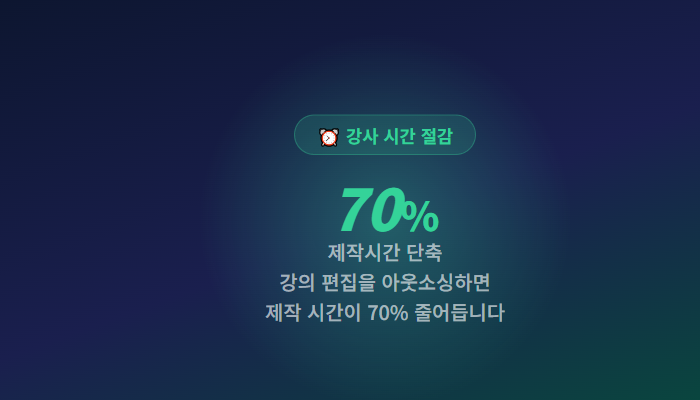
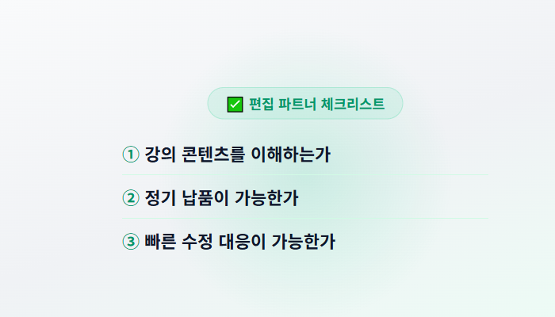

# 온라인 강사라면 꼭 알아야 할 영상 편집 아웃소싱 5가지 장점

> **SEO:** 온라인 강사 영상편집, 강의 영상 편집 외주, 교육 콘텐츠 제작

---

온라인 강의 시장이 빠르게 성장하면서 강의 콘텐츠의 **퀄리티**가 수강생 선택의 핵심 기준이 되고 있습니다.  
강의 내용도 중요하지만, **편집의 완성도**가 시청자의 몰입과 만족도를 결정합니다.

하지만 대부분의 강사분들은 이런 고민을 합니다:

> "강의 준비하고 촬영하고 나면 편집할 시간이 없다."
> "숏폼 홍보 영상은 누가 만들어주지?"
> "혼자서 유튜브 채널 운영하는 게 너무 버겁다."

정답은 **영상 편집 아웃소싱**입니다.  
이번 글에서는 온라인 강사가 영상 편집을 외주 맡겼을 때 얻을 수 있는 **5가지 실질적인 장점**을 소개합니다.

---

## 1. 강의 퀄리티가 비약적으로 상승한다

가장 큰 변화는 **편집의 전문성**입니다.

혼자서 직접 편집할 때는 어쩔 수 없이 놓치는 부분이 생깁니다:

- **H2: 자막의 가독성** — 폰트·크기·위치의 일관성 부족
- **H2: 호흡 조절** — 군더더기 장면, 침묵 구간 정리 미흡
- **H2: 브랜드 통일감** — 매 영상마다 다른 인트로/아웃트로

전문 편집자는 이런 요소를 한 번에 처리합니다.  
**강사는 내용에 집중**하고, 편집은 전문가에게 맡기는 구조가 가장 효율적입니다.

> **이미지 추천:** `blog_img_edu.png` (대표 이미지)  
> alt="온라인 강사 영상 편집 아웃소싱 장점"

---

## 2. 제작 시간이 70% 단축된다

1시간 강의를 촬영한 후 직접 편집하면 보통 **3~4시간**이 소요됩니다.  
여기에 자막 작업, 썸네일 제작, 숏폼 변환까지 하루가 다 갑니다.

**H3: 시간 활용의 차이**

| 항목 | 직접 편집 | 아웃소싱 |
|:-----|:--------:|:--------:|
| 1시간 강의 편집 | 3~4시간 | 0시간 |
| 숏폼 홍보 영상 | 1~2시간 | 0시간 |
| 자막/썸네일 | 30분~1시간 | 0시간 |
| **강의 기획에 투자 가능 시간** | **거의 없음** | **충분** |

즉, **강의 콘텐츠 기획과 촬영에 집중**할 수 있다는 것이 가장 큰 장점입니다.

---

## 3. 숏폼 채널을 자동으로 성장시킨다

온라인 강사에게 숏폼은 더 이상 선택이 아닙니다.  
인스타그램 릴스, 유튜브 쇼츠, 틱톡 — 모든 플랫폼이 숏폼에 검색 가중치를 주고 있습니다.

에이컷에 맡기면 **강의 원본만 보내면** 자막, BGM, 브랜드 로고가 적용된 릴스/쇼츠로 제작해 드립니다.

- **H3: 숏폼 게시 효과**
  - 릴스/쇼츠 게시 → 신규 수강생 유입
  - 강의 하이라이트 → 강의 관심도 상승
  - 꾸준한 업로드 → 채널 구독자 증가

> "쇼츠 숏폼 매주 2편 올린 후 구독자 3개월 만에 2배 증가했습니다."  
> — 프로그래밍 강사 J님

---

## 4. 편집 파트너 고를 때 체크할 3가지

처음 아웃소싱을 고려한다면 아래 3가지를 꼭 확인하세요.

1. **강의 콘텐츠를 이해하는가** — 단순 편집이 아니라 교육적 맥락을 이해하는 파트너
2. **정기 납품이 가능한가** — 주 1~2편, 월 8~10편 등 꾸준한 일정 유지
3. **빠른 수정 대응이 가능한가** — 시급한 수정 요청에 24시간 내 대응

이 조건을 충족하는 파트너를 고르면 **오래 지속되는 협업 관계**를 유지할 수 있습니다.

---

## 5. 지금 시작해야 하는 이유

온라인 교육 시장에서 **영상 콘텐츠의 중요성**은 점점 커지고 있습니다.  
네이버와 카카오 모두 숏폼과 영상 콘텐츠에 검색 가중치를 높이고 있습니다.

지금 시작하는 사람과 1년 후 시작하는 사람의 차이는 **채널 규모가 아니라 콘텐츠 누적량**에서 발생합니다.

> **결론:** 편집은 아웃소싱하고, 강의 기획과 촬영에 집중하세요.  
> 그게 가장 빠르게 채널을 성장시키는 방법입니다.

---

### 📞 지금 무료 상담 받기

영상 편집 아웃소싱이 처음이시라면 부담 없이 문의 주세요.  
강의 유형에 맞춘 맞춤 견적과 **샘플 편집본을 먼저 보내드립니다.**

📩 카카오톡 채널: 에이컷  
📧 이메일: contact@aicut.co.kr  
🌐 홈페이지: aicut.co.kr

---

**태그:**  
`#온라인강의 #영상편집외주 #온라인교육 #클래스101 #탈잉 #인프런 #유튜브강의 #숏폼마케팅 #강의영상 #교육콘텐츠 #에이컷 #릴스마케팅 #쇼츠마케팅 #온라인강사 #크리에이터 #영상편집업체 #강의편집 #영상마케팅 #콘텐츠마케팅 #인스타그램릴스 #유튜브쇼츠 #교육스타트업 #강의촬영 #자막편집 #브랜드영상 #강사마케팅 #온라인강의제작 #교육콘텐츠제작 #숏폼강의 #에듀테크`

---

## 체크리스트 (적용 항목)

- [x] **제목:** 키워드 "온라인 강사" 앞쪽 배치
- [x] **H2 태그:** 본문 내 5개 섹션 제목
- [x] **H3 태그:** 세부 항목 구분
- [x] **Strong(굵기):** 핵심 키워드에 적용
- [x] **이미지 alt:** 대표이미지 + 본문이미지 alt 기재
- [x] **글자 수:** 약 1,800자 (적정 범위)
- [x] **태그:** 26개 (20~30개 범위 내)
- [x] **CTA:** 문의 채널 명시
- [x] **목록/표:** 가독성 향상 요소 포함
